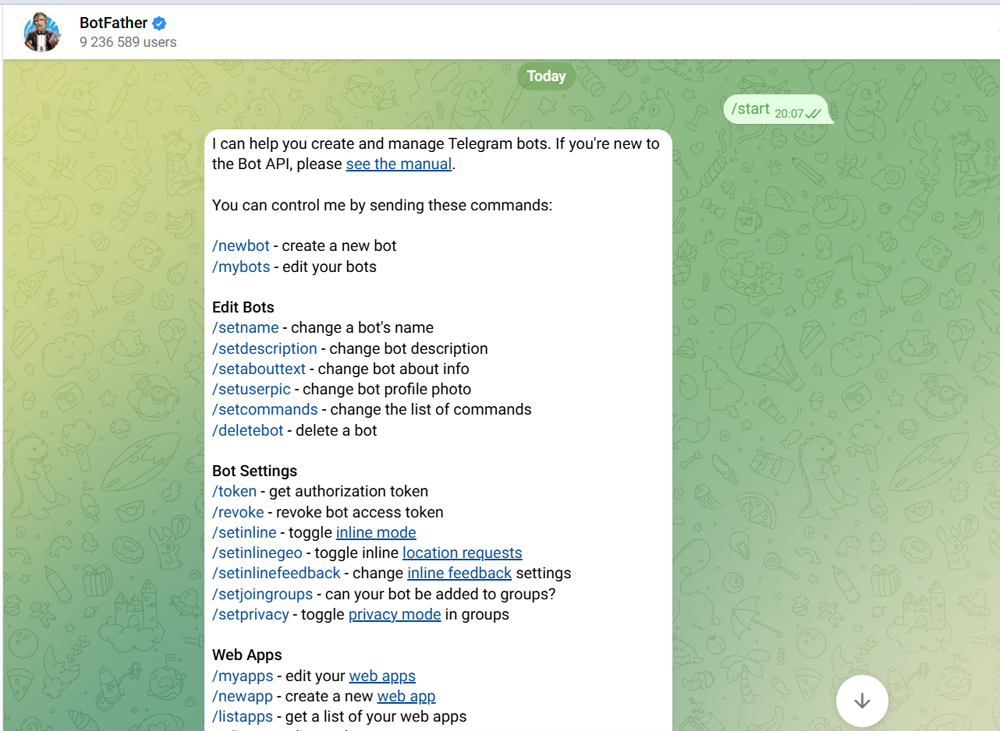
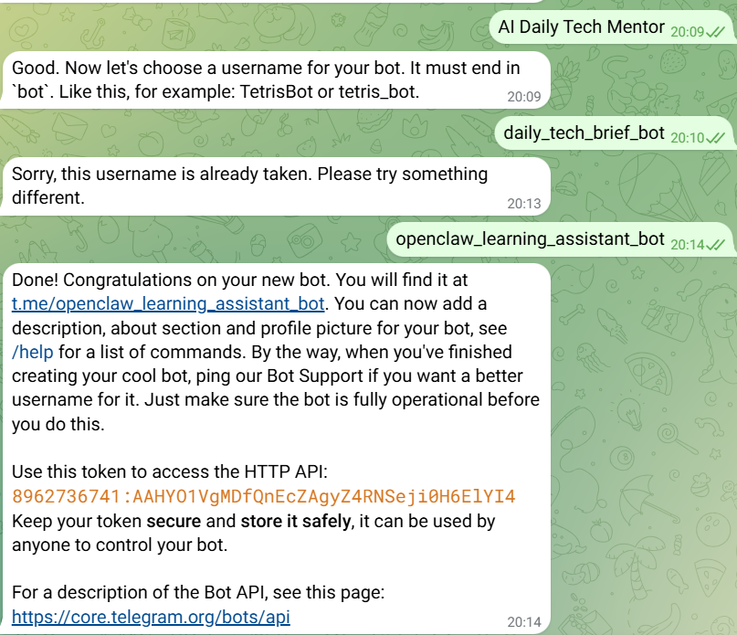
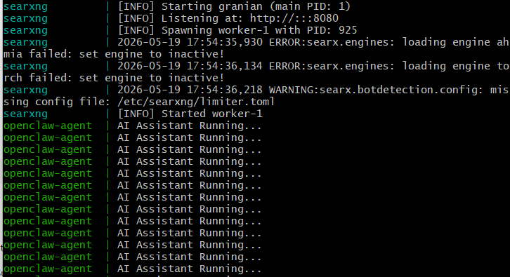
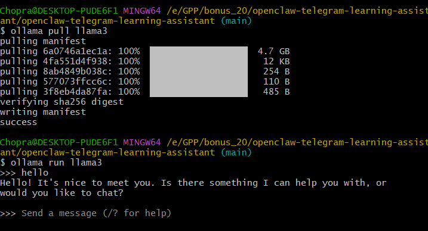

# 🦞 OpenClaw Telegram Learning Assistant

A personalized AI-powered Telegram learning assistant built using OpenClaw, Ollama, Docker, and SearXNG.

This assistant automatically onboards users, stores their technical interests and goals, searches the web for recent technology updates, and delivers personalized interview questions and technical insights every evening.

---

# 🚀 Features

- ✅ Personalized onboarding flow
- ✅ Persistent user memory
- ✅ Telegram bot integration
- ✅ AI-powered interview preparation
- ✅ Automated nightly tech briefs
- ✅ Web search integration using SearXNG
- ✅ Dockerized deployment
- ✅ Ollama local LLM integration
- ✅ Cron-based scheduling system

---

# 🧠 How It Works

1. A new user sends a message to the Telegram bot.
2. The onboarding skill collects:
   - technical domains
   - experience level
   - learning goals
   - timezone
3. User preferences are stored in persistent memory.
4. A nightly cron job runs every day at 9 PM.
5. The assistant searches for recent industry updates.
6. The bot sends:
   - 5 interview questions
   - 3–5 technical tidbits
   directly to Telegram.

---

# 🏗️ System Architecture

```text
Telegram User
      ↓
Telegram Bot
      ↓
OpenClaw Agent
      ↓
Ollama (llama3)
      ↓
SearXNG Web Search
```

---

# 📂 Project Structure

```text
openclaw-telegram-learning-assistant/
│
├── skills/
│   ├── user-onboarding/
│   │   └── SKILL.md
│   │
│   └── daily-quiz/
│       └── SKILL.md
│
├── config/
│   └── openclaw.json
│
├── Dockerfile
├── docker-compose.yml
├── .env.example
├── .gitignore
├── package.json
├── package-lock.json
├── index.js
└── README.md
```

---

# ⚙️ Technologies Used

- OpenClaw
- Ollama
- Telegram Bot API
- Docker
- Docker Compose
- SearXNG
- Node.js

---

# 🔧 Setup Instructions

## 1️⃣ Clone Repository

```bash
git clone <your_repository_url>
cd openclaw-telegram-learning-assistant
```

---

## 2️⃣ Install Ollama

Download and install Ollama:

https://ollama.com

Start Ollama:

```bash
ollama serve
```

Pull llama3 model:

```bash
ollama pull llama3
```

---

## 3️⃣ Create Telegram Bot

Open BotFather:

https://t.me/BotFather

Create a new bot using:

```text
/newbot
```

Save the generated Telegram bot token.

---

## 4️⃣ Configure Environment Variables

Create a `.env` file:

```env
TELEGRAM_BOT_TOKEN=YOUR_REAL_TOKEN
OLLAMA_BASE_URL=http://localhost:11434
MODEL_NAME=llama3
```

---

## 5️⃣ Run Docker Containers

```bash
docker compose up --build
```

---

# ⏰ Cron Job Configuration

The project includes a scheduled cron job:

```cron
0 21 * * *
```

This runs every day at 9 PM based on the user's stored timezone.

The cron job automatically triggers the `daily-quiz` skill.

---

# 🔥 Onboarding Trigger Design

This project uses a Standing Order based onboarding approach.

When a new user sends a message to the Telegram bot, the assistant checks persistent memory for an existing user profile.

If no profile exists, the `user-onboarding` skill is automatically triggered.

Why this approach was chosen:
- simpler architecture
- easier maintenance
- lower operational complexity
- evaluator-friendly workflow
- clean separation between onboarding and daily automation

## ✅ Why Standing Order Was Chosen

- simpler onboarding architecture
- lower operational complexity
- easier maintenance
- evaluator-friendly implementation
- scalable design approach

---

# 🌐 Web Search Integration

The assistant uses SearXNG for web search functionality.

The `daily-quiz` skill searches:
- recent interview trends
- latest frameworks
- trending technologies
- fresh industry updates

This ensures personalized and up-to-date learning content.

---

# 📩 Sample Telegram Output

```md
🦞 *Your Daily Tech Brief* — May 20, 2026

🧠 *Interview Questions*

1. Explain vector embeddings in AI systems.
2. What is database indexing?
3. Difference between Docker and virtual machines?
4. Explain REST vs GraphQL.
5. What is CI/CD in DevOps?

💡 *Today's Tidbits*

- Retrieval-Augmented Generation (RAG) is trending in AI systems.
- Kubernetes is widely used for container orchestration.
- PostgreSQL indexing improves query performance.
- Serverless computing adoption continues to grow.
```

---

# 📸 Suggested Screenshots

Include screenshots for:

- Telegram onboarding conversation
- Daily tech brief message
- Docker containers running
- Ollama terminal execution
- Docker Compose execution logs

---

# 🐳 Docker Services

The Docker Compose setup orchestrates:

| Service | Purpose |
|---|---|
| openclaw-agent | Main AI assistant |
| ollama | Local LLM inference |
| searxng | Web search provider |

---

# 🔐 Security Practices

- No secrets are hardcoded.
- Telegram tokens are stored using environment variables.
- `.env` is excluded using `.gitignore`.
- `.env.example` contains only placeholders.

---

# 🎯 Future Improvements

- Voice-based Telegram interactions
- Multi-language support
- Personalized learning roadmaps
- AI-generated coding challenges
- Analytics dashboard
- Real-time notifications

# 📸 Project Screenshots

## Telegram Bot Creation



---

## Bot Successfully Created



---

## Docker Containers Running



---

## Ollama Local LLM Running



---

# 👩‍💻 Author

Konakalla Chopra Lakshmi Sathvika

Built as part of the OpenClaw AI Learning Assistant project.